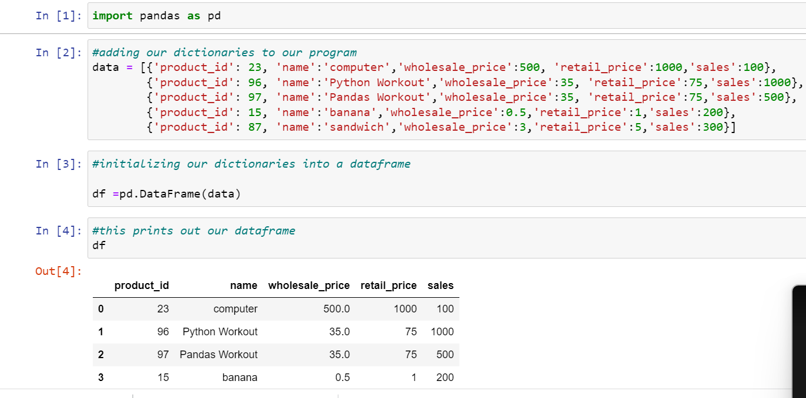
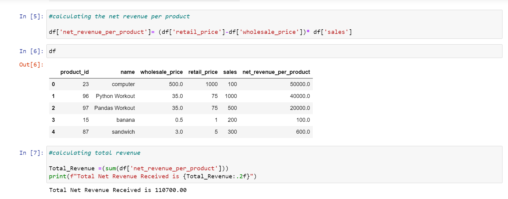
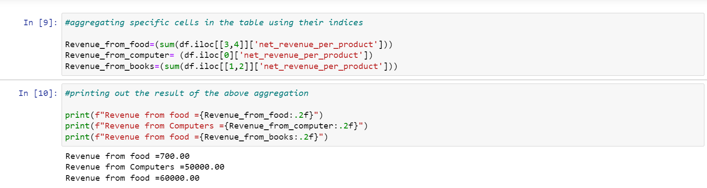
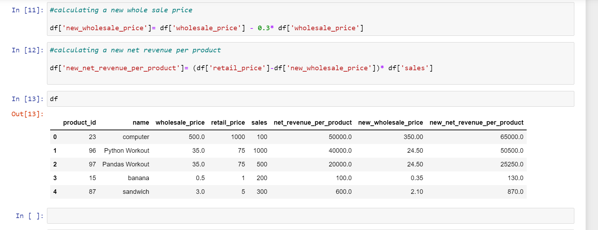

# Working-With-Pandas


####  This repository documents the stages I went through analyzing data with Pandas 


## Step 1
1. Import our pandas library 
2. Add our dictionaries (data) to the program 
3. Initialize our data into a datframe 
4. Visualize the data frame created 

#### Screenshot of the output 

-


## Step 2
Calculate the Total Profit for each product using the formula
```
net_revenue_per_product = (retail_price - wholesale price) * sales
```





## Step 3
Determine the following
- How much total net revenue you received from all of these sales?
- What product is product retail price more than twice the wholesale price?
- How much did the store make from food vs. computers vs. books?
- Because your store is doing so well, you’re able to negotiate a 30% discount on
the wholesale price of goods. Calculate the new net revenue




